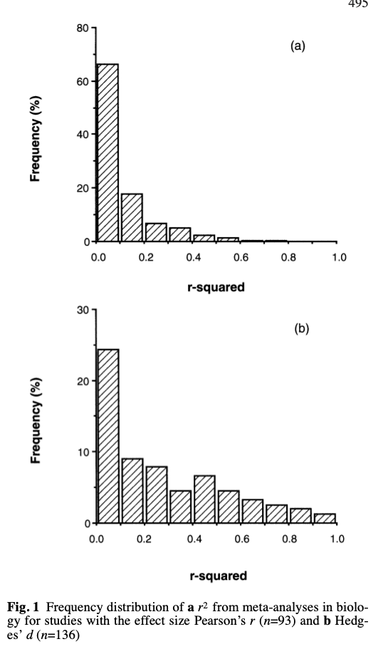
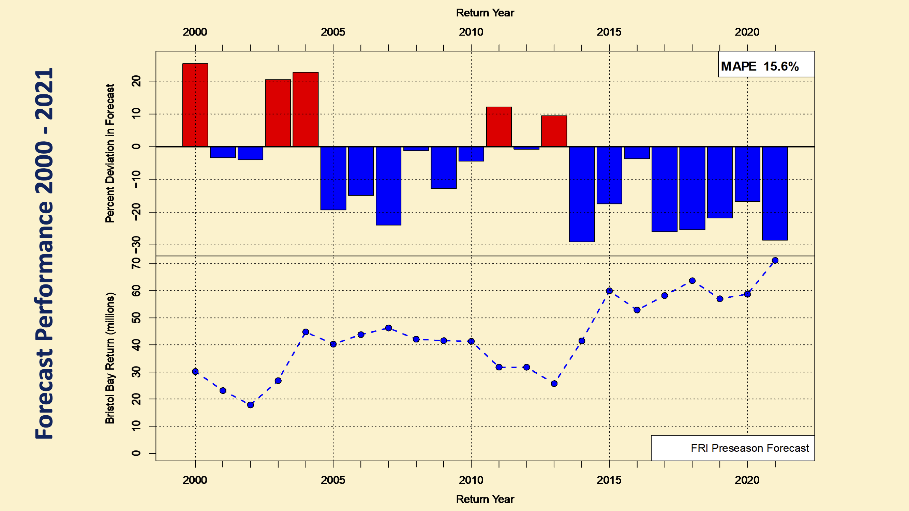
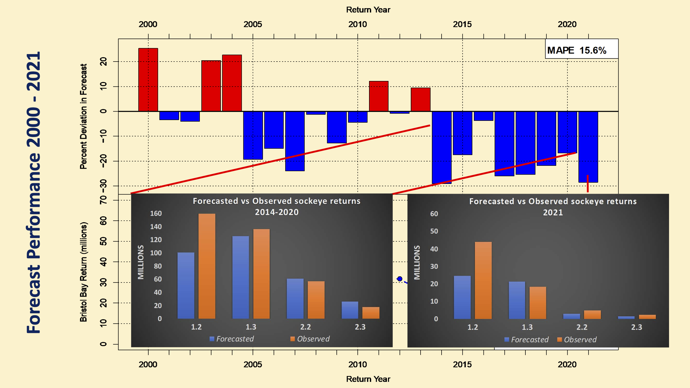
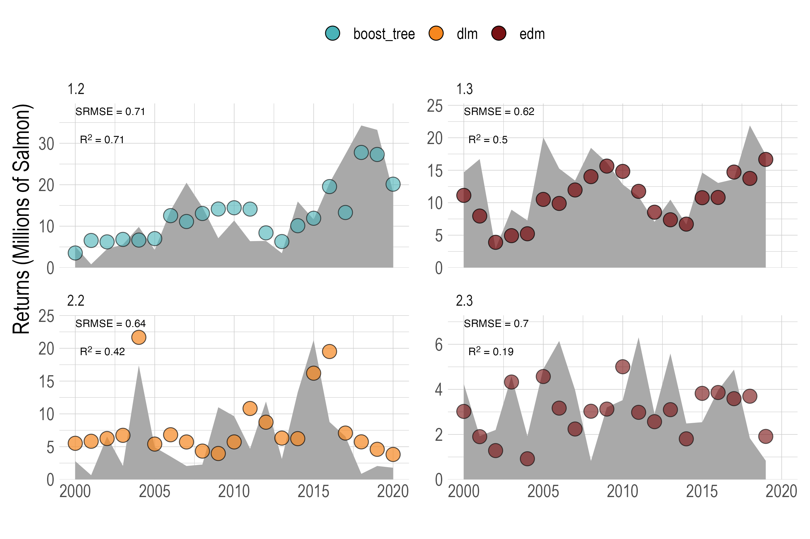
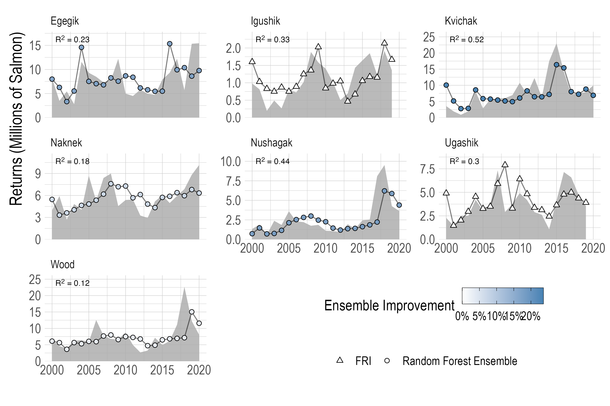
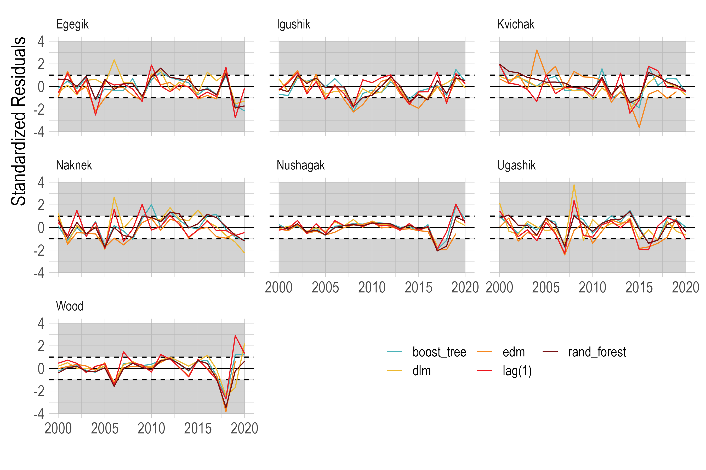

```{r xaringanExtra-freezeframe, echo=FALSE}

xaringanExtra::use_freezeframe(responsive = FALSE,overlay = TRUE)
```

```{r xaringan-tile-view, echo=FALSE}
xaringanExtra::use_tile_view()


```

```{r xaringan-scribble, echo=FALSE}
xaringanExtra::use_scribble()
```

```{r setup, include=FALSE}
library(xaringan)
library(xaringanExtra)
library(knitr)
library(tufte)
knitr::opts_chunk$set(echo = FALSE, message = FALSE, warning = FALSE, dev = "svg", fig.align = "center", out.width = "80%")
library(tidyverse)
library(here)

options(htmltools.dir.version = FALSE)


img_path <- here('imgs')
```


<!-- Capstone projects -->

<!-- Experience with getting people into a variety of careers -->

<!-- mention atlantis work -->


# A Quantiative Marine Scientist


> I use methods and ideas from ecology, economics, and data science to help understand and manage social-ecological systems. 


I study...
  
  - Fisheries assessment and management
  
  - Social-ecological impacts of policies
  
  - Predictive modeling in social-ecological systems
  
Using ...
 
  - Bayesian methods
 
  - Econometrics
 
  - Open and reproducible data science
  


???

.center[**An Optimistic Skeptic**]


What do I mean by an optimistic skeptic? Social-ecological systems are complicated. This both complicates our ability to clearly understand what is happening in them, and to identify simple solutions to complex problems. Hence, "skeptic": my prior is that uncertainty and complexity are the norm. Optimist though: I believe that science can help us navigate this uncertainty and complexity in a productive way, to help us move slowly towards better understanding and better outcomes. 


---


class: center, middle, inverse
### Follow along at [danovando.github.io/ucsd-seminar/slides](https://danovando.github.io/ucsd-seminar/slides#1)

---


class: center, middle, inverse
# Today's Topics

## 1. Forecasting Salmon

## 2. Effects of Protected Areas

## 3. Vision at UCSD

---

class: center, middle, inverse
# Forecasting Salmon Dynamics

---

class: center, middle, inverse

> Counting fish is just like counting trees, <br> except they move and are invisible
> `r tufte::quote_footer('---  John Shepherd (loosely)')`

---
to do

- tie the two cultures back together a bit more
- Turning to the "why"
# Predictive Modeling in Ecology

.pull-left[

[Breiman (2001)](https://projecteuclid.org/journals/statistical-science/volume-16/issue-3/Statistical-Modeling--The-Two-Cultures-with-comments-and-a/10.1214/ss/1009213726.full) talked about *two cultures*
  - **Why** do things happen?
  - **What will** happen?

Ecology has historically focused on the *why*

Society increasingly asking for the *what will*

.center[**Can new data and methods improve forecasting in social-ecological systems?**]


].pull-right[



[Møller & Jennions (2002)](https://www.jstor.org/stable/4223368)
]


---

# Let's Talk About Salmon

.center[]


.left[Courtesy of C. Cunningham]

---

# Let's Talk About Salmon

.center[
<video width="600" height="500" autoplay controls loop>
  <source src="imgs/salmon.mp4" type="video/mp4">
</video> 
]
---


# Let's Talk About Salmon

.pull-left[

Sockeye salmon (*Oncorhynchus nerka*) play a critical role in 
  
  - Ecosystems
  - Economics
  - Culture

They are also a useful case study in **predictive modeling**
  - Long time series
  - High-quality data
  - Dynamic
  - **Need for forecasts**

].pull-right[


]

---


# Things Have Been Changing


.center[]

---

# Historic Forecast Strategies

.pull-left[

- Fisheries Research Institute has provided forecasts since at least 1967

- Primary method has been **sibling regression**
  - Predict returns of cohort *this year* by trends in cohort in *previous years*
  

- Challenges
  - What about the youngest age classes?
  - What if maturation schedule changes?


].pull-right[


]


---

class: center, middle, inverse
#  

## How much can we improve pre-season forecasts of sockeye salmon?


---


# Parametric vs. Non-Parametric Models

.pull-left[
Historic FRI forecasts have focused on **parametric** models
  - Researchers determine functional forms, model assigns coefficients


**Non-parametric** models flip the problem
  - Models **learn** and fit functional forms to achieve objective
] .pull-right[

.small[.right[Chollet & Allaire 2018]]
]

???
- Omitting useful correlations

---

# Why Non-Parametric Models?


Parametric models can be limited by our imaginations (and patience)
  - Can result in model misspecification

Non-parametric models reduce chance of **predictive model misspecification**
  - If there's a good model to be found, they will find it

Allows us to explore
  - Non-linearities
  - Dynamic responses
  - Environmental correlations


---

# Models Explored


Random Forests (`ranger`)
  * Ensemble of *independent* regression trees

--

Boosted regression trees (`XGBoost`)
  * Ensemble of regression trees *that build on each other*

--

Recurrent neural networks (`tensorflow`)
  * A neural network *with memory*

--

Dynamic Linear Models (`MARSS`)
  * A hybrid linear regression with non-parametric dynamics

--

Empirical Dynamic Modeling (`rEDM`)
  * Predictions based on lags, predicated on Takens' theorem

--

The Might Lag(1)
  * Returns this year = returns last year

---

# Example Model

Predict returns of age group $a$ to river system *s* as a function of...
  - Historic cohort returns across all systems
  - Historic **non-cohort** returns across all systems
  - Other salmonids (pink, chum)
  - At-sea environmental covariates
    - Temperature 
    - Wind
    - PDO
    - Pressure

---

# Testing Strategy

.pull-left[

Goal is *one-year-ahead* forecasting

For each model... 

1. Tune-and-fit each model to pre-forecast year data

2. Compare performance against lag(1) benchmark

3. Repeat in rolling fashion from 2000 to 2020

4. Construct rolling-ensemble of models over same time period based on historic performance of individual models


].pull-right[
.center[]

]

---


# Historic Performance

.center[]

.left[.small[Courtesy of C. Boatright]]

???
don't forget to mention the bottom line
---

# Historic Performance

.center[]

.left[.small[Courtesy of C. Boatright]]


---

# Predicting Total Returns

.center[]

.left[.small[[Ovando *et al*. (2022)](https://cdnsciencepub.com/doi/10.1139/cjfas-2021-0287)]]


---


# Predicting Age Groups

.center[]

.left[.small[[Ovando *et al*. (2022)](https://cdnsciencepub.com/doi/10.1139/cjfas-2021-0287)]]

---

# Predicting River Systems

.center[]

.left[.small[[Ovando *et al*. (2022)](https://cdnsciencepub.com/doi/10.1139/cjfas-2021-0287)]]

---


# Ensemble Model


- Best-performing individual models reduced system-level RMSE by on average **15%**
  - "If you had picked the best model from 2000 to 2020..."

- But, managers have to decide which model to trust every year

- Historically done by AIC weighting

- We built statistical "model-of-models" to create a performance-weighed ensemble forecasts


---


# Ensemble Model

.center[]

.left[.small[[Ovando *et al*. (2022)](https://cdnsciencepub.com/doi/10.1139/cjfas-2021-0287)]]


---

# Why Didn't Things Improve More?

.center[]

.left[.small[[Ovando *et al*. (2022)](https://cdnsciencepub.com/doi/10.1139/cjfas-2021-0287)]]


---

# Improving Sockeye Salmon Forecasts

.pull-left[

XX bring back the two cultures

- Non-parametric models helped some
  * Highlighted value of cross-system and cross-ages correlations
  * 2022 Forecast: Another **70 million** year... 


**Strength of signals in data, not quality of model, limits performance**


- Areas of exploration

  * Size structure

  * Ecosystem drivers

  * Extensions to pink salmon


].pull-right[


]

---

# Future Directions in Predictive Modeling

.pull-left[

- Predictive models are a useful addition to the marine science toolbox
  - Benchmark forecasts

- How applicable are they for "slow" processes?

- Adding people to the equation


- **utility** over **accuracy**?

**Exciting opportunities for basic and applied research in social-ecological predictive modeling**

].pull-right[


]
???
Avoiding the "[forecast trap](https://onlinelibrary.wiley.com/doi/10.1111/ele.14024)
---


class: center, middle, inverse
## Effects of Protected Areas
???

Turning to the "why"

---


# Leaving the Walled Garden

.pull-left[

- Protected areas asked to play a growing role in **ecosystem-based management**
  
  - Protect 30% of land and water in the coming decade.
  
- Modern protected areas first seen as refuges from the outside world
  
- Protection has wider impacts
  
  - "spillover" of adult or larval organisms
  
  - Displacement of human activities 


].pull-right[

.center[]

]

---

class: center, top, inverse

## What effects do protected areas have on populations?

--


---


# MPAs - The Evidence


<br>
<br>
<br>
> The jury is in on marine reserves: They work.

> Research has repeatedly shown that fish numbers quickly climb following well-enforced fishing bans, 
> creating tangible benefits for fishers who work the surrounding waters.

.right[[NPR 2018](https://www.npr.org/sections/thesalt/2018/09/14/647441547/could-a-ban-on-fishing-in-international-waters-become-a-reality)]


---

# MPAs - The Evidence

.pull-left[

- MPAs seem simple: 
  - *Less fishing, more fish*

- Ample evidence of **more everything** inside MPAs than outside

- Problem solved?

  - Fish and Fishers move

  - What do we do when the **treatment** affects the **control**


].pull-right[

.center[`)]

.right[[Lester *et al.* (2009)](https://www.int-res.com/abstracts/meps/v384/p33-46)]

]


---


# Population-Level Effects of MPAs

.center[`)]


```{r, out.width="100%", fig.align="center", eval = FALSE}
knitr::include_graphics(file.path(img_path,"bio_anim.gif"))
```

???
Relatively sedentary adults, widely dispersed larvae with post-settlement density dependence

---

# Population-Level Effects of MPAs


.center[`)]


```{r, out.width="100%", fig.align="center", eval=FALSE}
knitr::include_graphics(file.path(img_path,"fleet_anim.gif"))
```

???
Relatively sedentary adults, widely dispersed larvae with post-settlement density dependence


---


# Case Study: Channel Islands MPAs

.center[`)]


---

# What Happend in the Channel Islands?

Trend for species targeted by fishing... Looks promising!

.center[`)]

---

# What Happend in the Channel Islands?

But wait... 

.center[`)]

---


# Estimating Population-Level Effects

.center[`)]


---

# Estimating Population-Level Effects

.center[`)]


---


# Estimating Population-Level Effects

.center[`)]

---


# Estimating Population-Level Effects

### General form

$$(log(D_{MPA=1, T = 1})-log(D_{MPA=0, T = 1}))-(log(D_{MPA = 1,T = 0})-log(D_{MPA =0, T = 0}))$$


### Bayesian Gamma GLM 

$$d_{i} \sim Gamma(e^{\beta_0 + \beta_1T_{i} +  \beta_2MPA_{i} + \color{red}{\beta_{3}}T_iMPA_i + \mathbf{B^cX_i} + \mathbf{B^sS_i}},shape)$$


### Hierarchical clustering of sites by island
$$\mathbf{B^s} \sim N(\beta_r,\sigma_r)$$ 


---

# Population-Level Effects of MPAs

.center[`)]

.left[[Ovando *et al.* (2021)](https://conbio.onlinelibrary.wiley.com/doi/abs/10.1111/cobi.13782)]

---


# Population-Level Effects of MPAs

.center[`)]

.left[[Ovando *et al.* (2021)](https://conbio.onlinelibrary.wiley.com/doi/abs/10.1111/cobi.13782)]

---


## Effects of Protected Areas

.pull-left[

- Protected areas can support ecosystem-based management

- Critical to consider effects **inside** and **outside**

-  **Population** effects may be smaller and harder to find than conventionally thought


- Communities should have a clear understanding of expected effects of protected areas


].pull-right[

.center[]

]


---

class: center, middle, inverse

# Vision at UC San Diego

---

class: center, middle, inverse

### A welcoming hub for interdisciplinary research on the <br> functioning and management of social-ecological systems


---

# Fisheries Assessment & Management

.pull-left[

Fisheries research is critical to conservation and human well-being

### Research  at UCSD
  - Data-limited models and harvest strategies
  
  - Modern monitoring tools

  - Supporting California fisheries
  
    - Climate-resilience
  
  - Ecosystem Based Management
    - Models & Policy
  
] .pull-right[


]

???
Atlantis
Forage fish
Coastal fisheries

---

# Data-Limited Stock Assessment


???
Partnership with Global Fishing Watch
---


# Reducing Fisheries Bycatch

.pull-left[

Bycatch remains a problem even in otherwise well-managed fisheries
  - Sharks, turtles, marine mammals

### Research at UCSD
  - [`marlin`](https://danovando.github.io/marlin/)
  
  - Bycatch prediction tools
  
  - Practical applications of dynamic ocean management
  
  - Economic incentives for bycatch reduction

].pull-right[

.center[]

.center[]


]

---

#  [`marlin`](https://danovando.github.io/marlin/)

.center[`)]


---

# [`marlin`](https://danovando.github.io/marlin/)

.center[]


---


#  Environmental Data Science
.pull-left[
New computational and data resources are opening frontiers in environmental science
### Research at UCSD

- Tools and best practices in predictive modeling for environmental problems
  - Confronting models with reality

- Collaborations bridging **data** and **marine** sciences
  - CALCOFI
  - CCE LTER
  - Management bodies


].pull-right[


]

???
What we do matters but so does how we do it. 

a pdp-11
Global weirding in Alaska

---


# Teaching & Mentorship

The opportunity to work with students is one of the primary reasons I hope to join the faculty at UCSD. 


### Goals at UCSD
  
  - Developing inclusive and useful quantitative classes
  
  - Creating learning communities around environmental data science
    - [EcoDataScience](https://eco-data-science.github.io/)
    
  - Preparing students for range of careers
  
  - Preparing students for the computer and the field

  - Connections with Latin America
  


???

Thigns are changing. The way we train students need to evolve. Leveraging the opporunity to be a bridge. 

Capstone projects

Experience with getting people into a variety of careers

Causal inference in social-ecological systems

Data science for environmental science

Assessing and managing marine populations

Career development starts before college
---

# Philosophy of Healthy Science

.pull-left[


Social-ecological problems are **complex**

**Solving** them requires
  
  - Open and reproducible science
  
  - Interdisciplinary collaboration
  
  - Diverse teams
  

.center[**I'm excited to help support healthy oceans and people as part of UCSD community**]


] .pull-right[

.center[]

]
???
We're one small part of the industry, and we touch a lot of lives: it's critical that 

---


# Questions?

.pull-left[

**slides:** <br>

[danovando.github.io/ucsd-seminar/slides](https://danovando.github.io/ucsd-seminar/slides)

**email:** danovan@uw.edu

**website:** [danovando.com](https://www.weirdfishes.blog/)

**twitter:** [@danovand0](https://twitter.com/DanOvand0)


#### Funding
  
  - Assessment: Food and Agriculture Organization of the United Nations
  
  - Protected Areas: NOAA Sea Grant Population and Ecosystem Dynamics Fellowship


].pull-right[

.center[ `)]


]


---


class: center, middle, inverse
# Extras

---


# Code is a Tool. 

.pull-left[

- Just because we can code it doesn't mean it's right

- Coding is easy (relatively speaking). 

- Ideas are hard
  - ideas should drive code, not *vice versa*
  
- We need to be willing to put our computer games to the test

].pull-right[

.center[]

]


---

# Inside vs. Outside = Effect?

.center[When MPA doesn't affect outside, *response ratio* is a good indicator]
--

.center[`)]


---

# Inside vs. Outside = Effect?

.center[When MPAs affect the outside, *response ratio* is a poor indicator]


--

.center[]

---

# Simulating Social-Ecological Systems with  [`marlin`](https://danovando.github.io/marlin/)

.center[]


---


# What Is an MPA?

.center[`)]


---

# What Is an MPA?
.center[`)]
---

# Social-Ecological Impacts of Protected Areas

.pull-left[
- Ecosystem-based management includes impacts of policies on **people**

- The bigger the protected area...
  - The more likely substantial conservation success
  - The less likely benefits to fisheries

- Surprisingly limited empirical evidence

- Goal at UCSD: **Empirical research on the impacts of MPAs**
  - Focus on Oregon & California Current
  - Applications globally

]
.pull-right[

.center[]

]

---

# Social-Ecological Impacts of Protected Areas


.center[]


---

# Variable Importance Scores

.center[   ]

.left[.small[[Ovando *et al*. (2022)](https://cdnsciencepub.com/doi/10.1139/cjfas-2021-0287)]]

---

# Retrospective Bias

.center[   ]

.left[.small[[Ovando *et al*. (2022)](https://cdnsciencepub.com/doi/10.1139/cjfas-2021-0287)]]

---


# Forecasting Salmon

Salmon management depends on a variety of forecasts

**Spawner-recruit** models guide management targets

**In-Season** forecasts inform daily fishery decisions
  - Run timing and volume
  
**Pre-Season** forecasts support planning by communities and managers


---

# Why So Many Models?

.pull-left[

- In parametric modeling, we often pick models based on **theory**
  - GAM vs. GLM vs. GLMER etc. 

- For regression-style problems little inherent reason for one non-parametric method over another

- Range of models allows us to explore best performers for different tasks
  - And ensemble, for better or worse... 

].pull-right[


]


---


